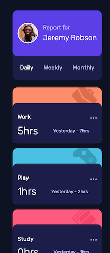
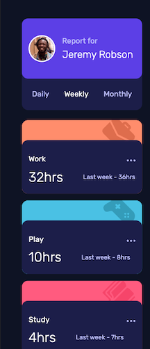
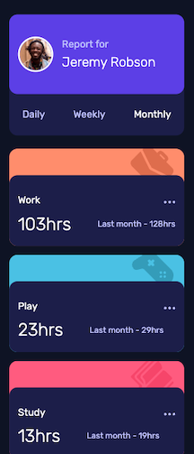
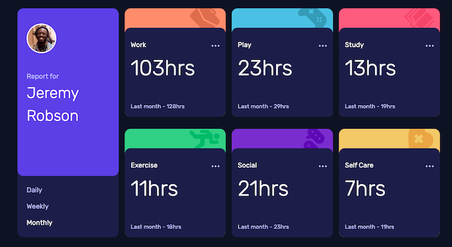

# Time Tracking Dashboard Solution

This is a solution to the [Time tracking dashboard challenge on Frontend Mentor](https://www.frontendmentor.io/challenges/time-tracking-dashboard-UIQ7167Jw). Frontend Mentor challenges help you improve your coding skills by building realistic projects.

## Table of contents

- [Overview](#overview)
  - [The challenge](#the-challenge)
  - [Screenshot](#screenshot)
  - [Links](#links)
- [My process](#my-process)
  - [Built with](#built-with)
  - [What I learned](#what-i-learned)
  - [Continued Development](#continued-development)
  - [Useful resources](#useful-resources)
- [Author](#author)

## Overview

### The challenge

The challenge is to build out this dashboard and get it looking as close to the design as possible.

A local `data.json` file for the activities is provided. The data is pulled from this file into the app.

Users should be able to:

- View the optimal layout for the site depending on their device's screen size
- See hover states for all interactive elements on the page
- Switch between viewing Daily, Weekly, and Monthly stats
- The text for the previous period's time should change based on the active timeframe. For Daily, it should read "Yesterday" e.g "Yesterday - 2hrs". For Weekly, it should read "Last Week" e.g. "Last Week - 32hrs". For monthly, it should read "Last Month" e.g. "Last Month - 19hrs".

### Screenshot

  

### Links

- Github Repo URL: [Time Tracking Dashboard Repo](https://github.com/amyspencerproject/time-tracking-dashboard-vite)
- Live Site URL: [ Time Tracking Dashboard Page](https://mellow-marigold-a587e3.netlify.app/)

## My process

### Built with

- Mobile-first workflow
- CSS
- Vite
- React JS

### What I learned

- When you import a `.json` file into React it will automatically be parsed 🥳

- Used an unordered list with roles and aria-labels for accessibility on the time frame options in the ProfileCard component. The user needs to be able to switch between daily, weekly, and monthly states. For accesibiltiy they should be able to do this with a mouse and a keyboard. Additionally, it should be clear to a screen reader that these are choices grouped together. Using a list leaves no doubt that the choices are grouped.

- Not sure the best approach for handling the larger data set that is `data`. Would it be alright to pull each object out into a variable named for it's category and then just handle data separatly? Or should you always keep the data source as the primary place to get data from?

### Continued development

- Not satisfied with how the way I pulled the selected time frame data out of the data.json file.
- The ReportCard JSX could be reduced to just one `
` if the svg icons were not inline. I haven't use svg's in sprite and I think this would be the way to get the icons into a form where they could be part of the data and pulled into the JSX by being `map()-ed` over.

### Useful resources

- [Tabs for Accessibility](https://inclusive-components.design/tabbed-interfaces/) - In depth look at using tabbed interfaces ie lists with role/aria labeling for better accessibility

## Author

- Website - [Amy Spencer](https://spencerproject.com/)
- Frontend Mentor - [@amyspencerproject](https://www.frontendmentor.io/profile/amyspencerproject)
- Linkedin - [amyspencercodes](https://www.linkedin.com/in/amyspencercodes/)
